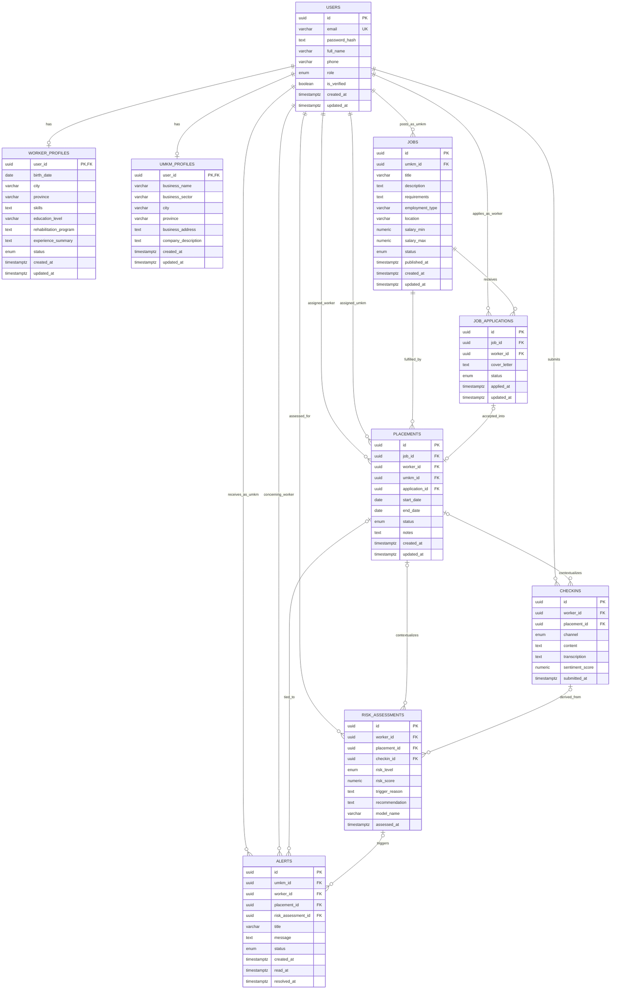

# BinaHub ERD (Visual)

```mermaid
erDiagram
    USERS {
        uuid id PK
        varchar email UK
        text password_hash
        varchar full_name
        varchar phone
        enum role
        boolean is_verified
        timestamptz created_at
        timestamptz updated_at
    }

    WORKER_PROFILES {
        uuid user_id PK,FK
        date birth_date
        varchar city
        varchar province
        text skills
        varchar education_level
        text rehabilitation_program
        text experience_summary
        enum status
        timestamptz created_at
        timestamptz updated_at
    }

    UMKM_PROFILES {
        uuid user_id PK,FK
        varchar business_name
        varchar business_sector
        varchar city
        varchar province
        text business_address
        text company_description
        timestamptz created_at
        timestamptz updated_at
    }

    JOBS {
        uuid id PK
        uuid umkm_id FK
        varchar title
        text description
        text requirements
        varchar employment_type
        varchar location
        numeric salary_min
        numeric salary_max
        enum status
        timestamptz published_at
        timestamptz created_at
        timestamptz updated_at
    }

    JOB_APPLICATIONS {
        uuid id PK
        uuid job_id FK
        uuid worker_id FK
        text cover_letter
        enum status
        timestamptz applied_at
        timestamptz updated_at
    }

    PLACEMENTS {
        uuid id PK
        uuid job_id FK
        uuid worker_id FK
        uuid umkm_id FK
        uuid application_id FK
        date start_date
        date end_date
        enum status
        text notes
        timestamptz created_at
        timestamptz updated_at
    }

    CHECKINS {
        uuid id PK
        uuid worker_id FK
        uuid placement_id FK
        enum channel
        text content
        text transcription
        numeric sentiment_score
        timestamptz submitted_at
    }

    RISK_ASSESSMENTS {
        uuid id PK
        uuid worker_id FK
        uuid placement_id FK
        uuid checkin_id FK
        enum risk_level
        numeric risk_score
        text trigger_reason
        text recommendation
        varchar model_name
        timestamptz assessed_at
    }

    ALERTS {
        uuid id PK
        uuid umkm_id FK
        uuid worker_id FK
        uuid placement_id FK
        uuid risk_assessment_id FK
        varchar title
        text message
        enum status
        timestamptz created_at
        timestamptz read_at
        timestamptz resolved_at
    }

    USERS ||--o| WORKER_PROFILES : has
    USERS ||--o| UMKM_PROFILES : has

    USERS ||--o{ JOBS : posts_as_umkm
    USERS ||--o{ JOB_APPLICATIONS : applies_as_worker

    JOBS ||--o{ JOB_APPLICATIONS : receives

    USERS ||--o{ PLACEMENTS : assigned_worker
    USERS ||--o{ PLACEMENTS : assigned_umkm
    JOBS ||--o{ PLACEMENTS : fulfilled_by
    JOB_APPLICATIONS o|--o| PLACEMENTS : accepted_into

    USERS ||--o{ CHECKINS : submits
    PLACEMENTS o|--o{ CHECKINS : contextualizes

    USERS ||--o{ RISK_ASSESSMENTS : assessed_for
    PLACEMENTS o|--o{ RISK_ASSESSMENTS : contextualizes
    CHECKINS o|--o{ RISK_ASSESSMENTS : derived_from

    USERS ||--o{ ALERTS : receives_as_umkm
    USERS ||--o{ ALERTS : concerning_worker
    PLACEMENTS o|--o{ ALERTS : tied_to
    RISK_ASSESSMENTS o|--o{ ALERTS : triggers
```
